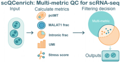

<!-- README.md is generated from README.Rmd. Please edit that file -->

```{r, include = FALSE}
knitr::opts_chunk$set(
  collapse = TRUE,
  comment = "#>",
  fig.path = "man/figures/README-",
  out.width = "100%"
)
```

# scQCenrich
<p align="center">
  
</p>
<!-- badges: start -->
[](https://github.com/lemonlyy755/scQCenrich/actions/workflows/R-CMD-check.yaml)
<!-- badges: end -->

scQCenrich is an advanced, annotation-aware quality control framework for single-cell RNA-seq (scRNA-seq) data. It goes beyond simple static thresholds by integrating multi-metric filtering—including standard Seurat metrics and optional spliced/unspliced ratios from droplet data. scQCenrich has the option to automatically handles doublets, performs cell-type auto-annotation, and uniquely emphasizes the rescue of biologically meaningful, cohesive clusters that may otherwise be incorrectly flagged as 'low quality' by basic filters.
## Installation

You can install the development version of scQCenrich from [GitHub](https://github.com/) with:

``` r
install.packages("BiocManager")
remotes::install_github(
  "lemonlyy755/scQCenrich",
  dependencies = TRUE,
  repos = BiocManager::repositories()
)

vignettes:
install.packages(c("knitr","rmarkdown"))     
if (!requireNamespace("BiocManager", quietly = TRUE)) install.packages("BiocManager")

remotes::install_github(
  "lemonlyy755/scQCenrich",
  dependencies   = TRUE,
  build_vignettes = TRUE,
  repos          = BiocManager::repositories()
)
browseVignettes("scQCenrich")


```

## Example use

This is a basic usage example
Note: SeuratWrappers does not work in windows os.
```r
library(scQCenrich)
library(Seurat)
library(SeuratWrappers)

seurat_std <- CreateSeuratObject(counts =  Read10X("your filtered count folder path"))
seurat_sp <- as.Seurat(ReadVelocity(file = 'your velocyto loom file.loom')) 

res <- run_qc_pipeline(
  obj          = seurat_std,                 
  species      = "mouse", #edit your species mouse or human
  spliced_obj        = seurat_sp,
  unspliced_obj      = seurat_sp,
  report_file  = "qc_outputs/qc_report.html"
)

browseURL(res$report)

```


## Loom Example

This is a basic example to convert velocyto loom file into seurat obj rds to be used in windows OS setting:
Note: this step cannot be done in windows.
```r
library(Seurat)
library(velocyto.R)
library(SeuratWrappers)


ldat <- ReadVelocity(file = '/path/to/your/loomfile.loom')

# 1) Ensure unique feature names within each layer
for (nm in intersect(names(ldat), c("spliced","unspliced","ambiguous"))) {
  rn <- rownames(ldat[[nm]])
  rn[is.na(rn) | rn == ""] <- paste0("gene_", seq_along(rn))
  rownames(ldat[[nm]]) <- make.unique(rn)  # enforce uniqueness
}

# 2) Keep only the shared features across layers and align their order
has_layer <- intersect(names(ldat), c("spliced","unspliced","ambiguous"))
features <- Reduce(intersect, lapply(ldat[has_layer], rownames))
for (nm in has_layer) {
  ldat[[nm]] <- ldat[[nm]][features, , drop = FALSE]
}

# 3) Ensure cell barcodes are unique and aligned across layers
cells <- Reduce(intersect, lapply(ldat[has_layer], colnames))
stopifnot(length(cells) > 0)
for (nm in has_layer) {
  # If your loom has duplicate barcodes (rare), make them unique
  cn <- colnames(ldat[[nm]])
  if (anyDuplicated(cn)) colnames(ldat[[nm]]) <- make.unique(cn)
  ldat[[nm]] <- ldat[[nm]][, cells, drop = FALSE]
}

# 4) Convert to Seurat (v5)
bm <- as.Seurat(ldat)   # should now pass without the LogMap error
saveRDS(bm,"testloom.rds")

```

### Using the Toy Dataset

`scQCenrich` comes bundled with a small toy dataset (`toy_seu`) that you can use to immediately test out the pipeline:

```r
library(scQCenrich)

# Load the built-in toy Seurat object
data("toy_seu")
print(toy_seu)

# Run the QC pipeline on the toy dataset
res_toy <- run_qc_pipeline(
  obj         = toy_seu,
  species     = "human",
  method      = "gmm",
  qc_strength = "auto",
  report_file = "qc_outputs/toy_qc_report.html"
)

browseURL(res_toy$report)
```

### Profiling scQCenrich Against Other Methods

If you wish to compare `scQCenrich`'s performance against standard metrics, you can write a short benchmarking script. The snippet below highlights how one might track which cells are retained across different methodologies:
complete benchmarking script can be found in inst/benchmarking.r
```r
library(scQCenrich)
library(Seurat)
library(ggplot2)

# Assuming 'seu' is your starting Seurat object.

# 1. Base Seurat thresholding
seu$keep_seurat <- with(seu@meta.data, 
                        nFeature_RNA > 200 & nFeature_RNA < 10000 & percent.mt < 10)

# 2. scQCenrich (with just GMM auto-thresholding on basic metrics)
metrics <- calcQCmetrics(obj = seu, species = "human", add_to_meta = FALSE)
scQC_res <- flagLowQuality(metrics = metrics, method = "gmm", qc_strength = "auto")
seu$keep_scQC <- scQC_res$qc_status != "remove"

# You can then cross-tabulate retention rates
table(Seurat = seu$keep_seurat, scQC = seu$keep_scQC)

# Or visualize retention per cluster/cell_type
# (Assuming your object has a 'cell_type' or 'seurat_clusters' column)
retention_df <- data.frame(
  CellType = seu$cell_type,
  Seurat_Retained = seu$keep_seurat,
  scQC_Retained = seu$keep_scQC
)
# ... grouping and ggplot logic similar to standard analyses
```
Main Features

run_qc_pipeline() – one-liner wrapper for the full QC workflow with plots and reports.

Vignettes

See the package vignettes for detailed tutorials
