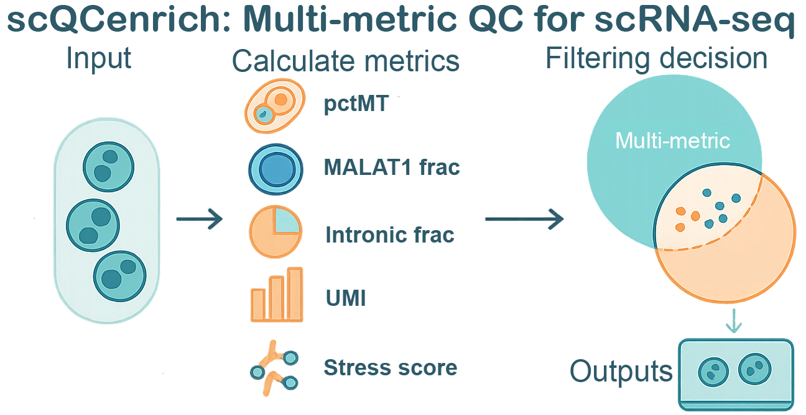

<!-- README.md is generated from README.Rmd. Please edit that file -->

# scQCenrich

<p align="center">


</p>

<!-- badges: start -->

<!-- badges: end -->

scQCenrich is an annotation-aware quality control framework for
single-cell RNA-seq data that integrates multiple QC metrics and
enrichment analysis to flag damaged cells while preserving biologically
meaningful profiles.

## Installation

You can install the development version of scQCenrich from
[GitHub](https://github.com/) with:

``` r
# install.packages("pak")
pak::pak("lemonlyy755/scQCenrich")
```

## Example

This is a basic example which shows you how to solve a common problem:

``` r
library(scQCenrich)
library(Seurat)
library(SeuratWrappers)

seurat_std <- CreateSeuratObject(counts =  Read10X("your filtered count folder path"))
seurat_sp <- as.Seurat(ReadVelocity(file = 'your velocyto loom file.loom')) 

res <- run_qc_pipeline(
  obj          = seurat_std,                 
  species      = "mouse", #edit your species mouse or human
  spliced_obj        = seurat_sp,
  unspliced_obj      = seurat_sp,
  report_file  = "qc_outputs/qc_report.html"
)

browseURL(res$report)
```

Main Features

run_qc_pipeline() – one-liner wrapper for the full QC workflow with
plots and reports.

Vignettes

See the package vignettes for detailed tutorials
